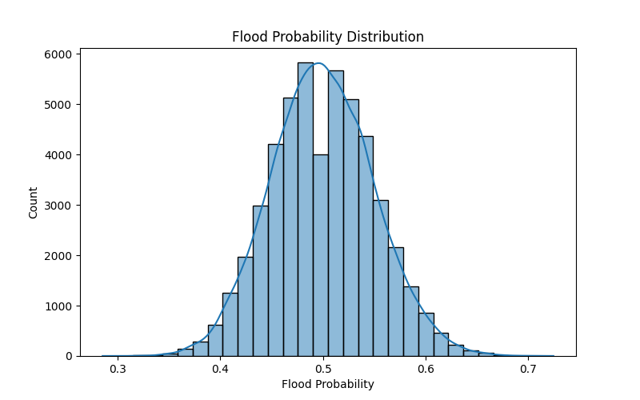
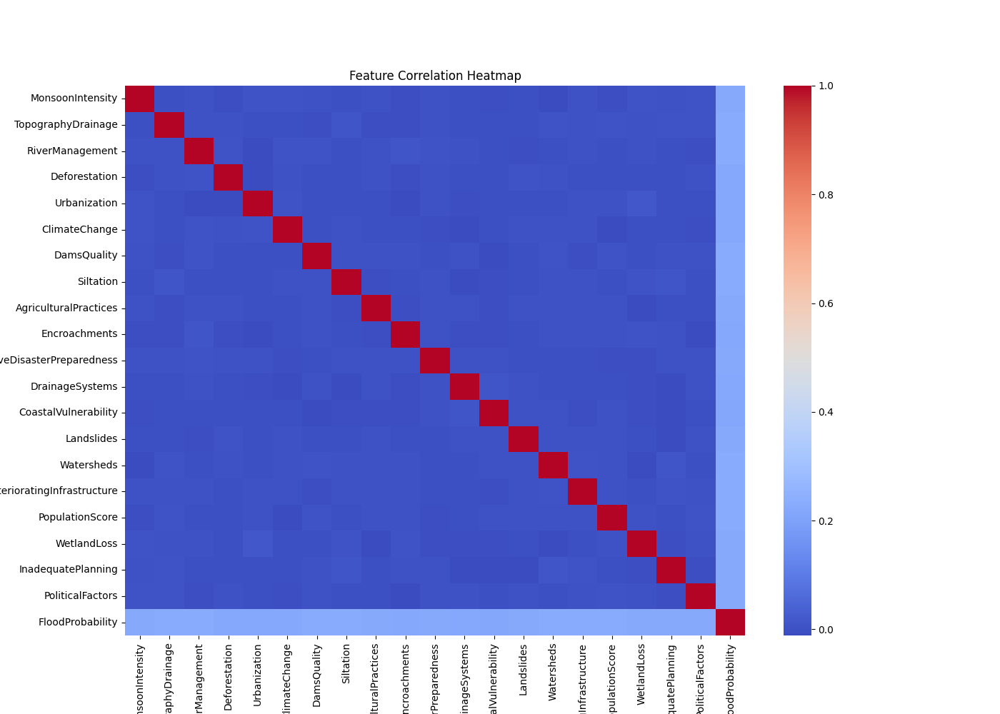
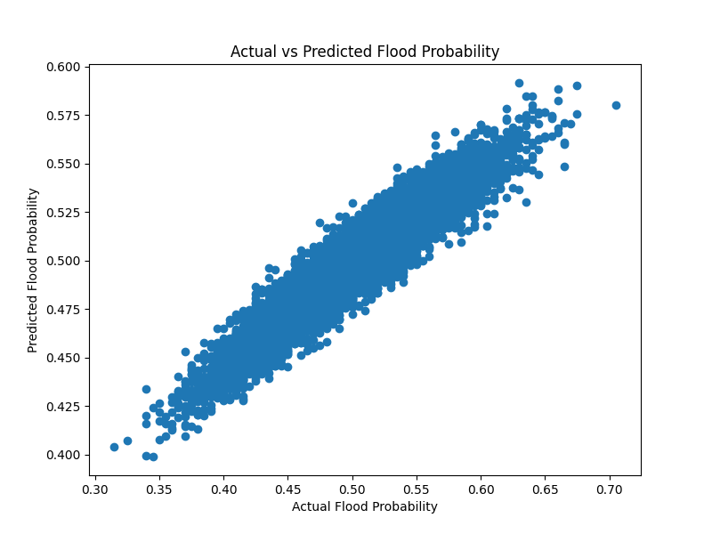
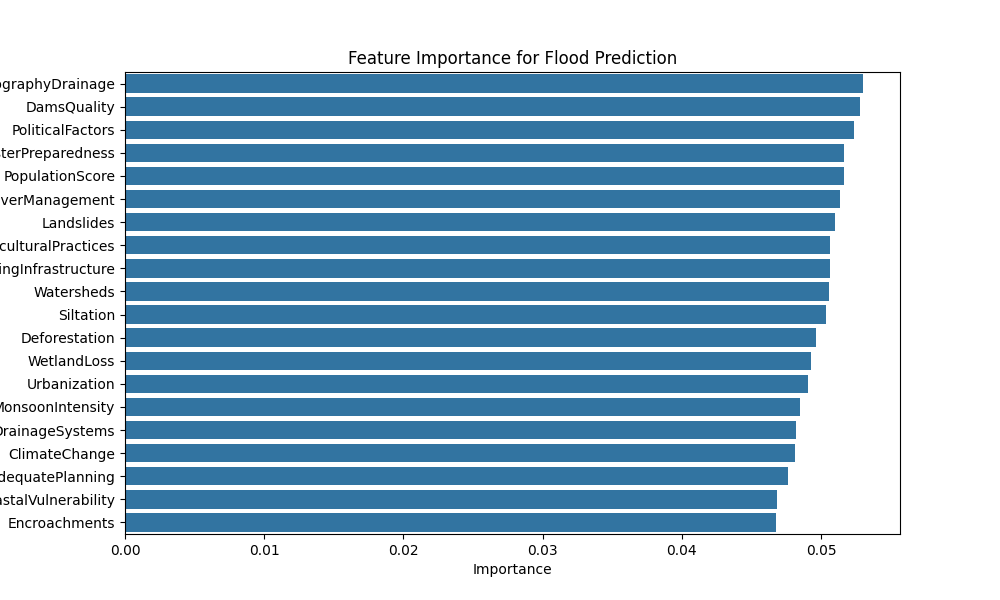

# Flood Prediction Using Machine Learning

## Project Overview
This project predicts the probability of flooding using environmental and geographical factors such as rainfall intensity, river management, deforestation, drainage systems, and urbanization.
This is a beginner machine learning project that predicts flood probability using environmental data.

---

## Dataset
The dataset contains 50,000 samples with 21 features representing different environmental conditions.

Important features include:
- MonsoonIntensity
- TopographyDrainage
- RiverManagement
- Deforestation
- Urbanization
- ClimateChange
- DrainageSystems
- PopulationScore
- WetlandLoss
- PoliticalFactors

Target variable:
FloodProbability

---

## Model Performance
R² Score ≈ 0.73  
Mean Squared Error: very low

---

## Visualizations
This project includes:

## Flood Probability Distribution

---

## Feature Correlation Heatmap

---

## Actual vs Predicted Flood Probability

---

## Feature Importance

---

## How to Run

Clone the repository

git clone https://github.com/dograsarishty367-afk/flood-prediction.git

Install libraries

pip install pandas numpy matplotlib seaborn scikit-learn

Run the model

python3 flood_prediction.py

---

## Project Workflow

1. Load the flood dataset using Pandas
2. Explore dataset structure and statistics
3. Check missing values and clean data
4. Perform Exploratory Data Analysis (EDA)
5. Visualize flood probability distribution
6. Generate correlation heatmap for features
7. Prepare training and testing datasets
8. Train Random Forest Regressor model
9. Evaluate model using MSE and R² score
10. Analyze feature importance
11. Compare actual vs predicted flood probability
12. Predict flood probability for new input data

---

## Future Improvements

- Use real rainfall and river level data
- Integrate real-time weather APIs

---

## Author
Sarishty Dogra
